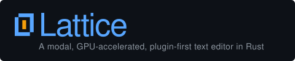

# Dhruva Sagar

**Fractional CTO · Software Architect · Engineering Leader**

[](https://www.linkedin.com/in/dhruvasagar)
[](https://twitter.com/dhruvasagar)
[](https://dhruvasagar.dev)
[](mailto:dhruva.sagar@protonmail.com)

---

I partner with founders and product teams as a **Fractional CTO** — bringing ~20 years of engineering depth across product strategy, system architecture, security, and delivery. I've led teams, shaped platforms, and shipped software across industries. My work sits at the intersection of technical rigor and business outcomes.

I care deeply about **software craftsmanship**: sound architecture, clean abstractions, developer experience, and building systems that age well. I'm equally at home auditing a codebase, defining an engineering roadmap, or pairing with a team to untangle a gnarly problem.

---

## What I Do

- **Fractional CTO / Technical Advisory** — Embedded leadership for early-stage and scaling companies: roadmap ownership, architecture decisions, team structure, hiring bars, and vendor evaluation.
- **Engineering Due Diligence** — Code and architecture audits for investors and acquirers; compliance and security posture reviews.
- **Platform & Product Architecture** — Full-stack systems design, API strategy, data modeling, and release pipeline design.
- **Team Enablement** — Engineering culture, process design, documentation practices, and mentorship.

---

## Stack & Craft

Over two decades I've worked across many layers of the stack. Here's where I spend most of my time today:

**Languages I reach for:** Rust · Haskell · Elixir · Go · TypeScript · Ruby
**Runtimes & Frameworks:** Node.js · Phoenix · Rails · React
**Infrastructure:** Linux · PostgreSQL · Redis · Docker · AWS/CloudFront
**Tooling:** Neovim (daily driver) · Git · TUI tools · Terminal-first workflows

I'm currently deepening my work in **Rust** and **Haskell** — languages where the type system does serious work.

---

## Featured: Lattice

<picture>
  <source media="(prefers-color-scheme: dark)" srcset="./media/banner-dark.svg">
  <source media="(prefers-color-scheme: light)" srcset="./media/banner-light.svg">
  
</picture>

> **[dhruvasagar/lattice](https://github.com/dhruvasagar/lattice)** — A modal, GPU-accelerated, plugin-first text editor written in Rust.

My most ambitious open-source project. Lattice is not a config layer or a fork — it's a ground-up text editor built on the conviction that the three dominant editors (Vim, Emacs, VS Code) each got *one* thing profoundly right, and that a modern Rust foundation can unify all three without their compromises.

**What makes it different:**

- **Vim's modal grammar is the public command API** — not a keymap over a non-modal core. Operators, motions, text objects, counts, registers, macros — all semantically exact. Adding a motion *is* extending the grammar.
- **Emacs's extensibility model via WebAssembly** — plugins are sandboxed WASM components (any language with Component Model support: Rust, Zig, Go). A misbehaving plugin cannot freeze the editor. WIT is the canonical API today, not aspirationally.
- **Everything is a buffer, enforced** — file tree, diagnostics, terminal, scratch — all placed via splits. No fixed sidebars or bottom panels. One code path for all buffer kinds.
- **Sub-frame input latency (<8 ms at 120 Hz)** — the UI thread does *no* I/O, no parsing, no shaping. Asynchrony is architectural, not disciplinary: `RenderState` reads, `ArcSwap` snapshots, one `tokio` task per document. UI-thread blocking is physically impossible by construction.
- **Compile-time threading guarantees** — the `EditorActorHandle` swap means `&mut Editor` cannot escape the editor thread in production builds. The type system enforces the architecture.

**Where it stands:** 1,000+ commits, 20 crates, Phases 0–5 structurally complete (foundation → modal engine → TUI → tree-sitter → LSP → GPU rendering). Phase 7 (WASM plugin host) is next. Backed by a [2,300-line design spec](https://github.com/dhruvasagar/lattice/blob/main/docs/dev/architecture/design.md), CI-tracked performance benchmarks, and ~1,115 tests.

```
Keystroke → buffer mutation  ~83 µs p99   (target: <100 µs)
Reflex motion / operator     <2 ms p99    (target: <2 ms)
Search on 200k-line buffer   <2 ms p99    (target: <2 ms)
```

---

## Other Open Source

| Project | Description |
|---|---|
| [vim-table-mode](https://github.com/dhruvasagar/vim-table-mode) | Automatic table formatting for Vim — widely used, actively maintained |
| [vim-dotoo](https://github.com/dhruvasagar/vim-dotoo) | Org-mode inspired task management inside Vim |
| [vim-prosession](https://github.com/dhruvasagar/vim-prosession) | Ergonomic session management for Vim |
| [vim-testify](https://github.com/dhruvasagar/vim-testify) | Unit testing framework for VimScript |
| [dumbhttp](https://github.com/dhruvasagar/dumbhttp) | Lightweight HTTP mock server in Rust |
| [cursed-timer](https://github.com/dhruvasagar/cursed-timer) | Rubik's Cube timer — a TUI app in Rust |
| [url-mapper-rs](https://github.com/dhruvasagar/url-mapper-rs) | Keyword-based URL mapper in Rust |

---

## A Few Things About Me

- I automate relentlessly — if I do something twice, I script it
- Linux is home; the terminal is where I live
- I make technical content on YouTube: [youtube.com/@dhruvasagar](https://www.youtube.com/channel/UCWC5C7O-jpJhHW7sSxu-27A) — more in the pipeline
- Competitive programming enthusiast
- Pronouns: He/Him

---

## GitHub at a Glance

<p align="center">
  
  &nbsp;&nbsp;
  
</p>

<p align="center">
  
</p>

---

*Open to select fractional and advisory engagements. Reach me at [dhruva.sagar@protonmail.com](mailto:dhruva.sagar@protonmail.com)*
